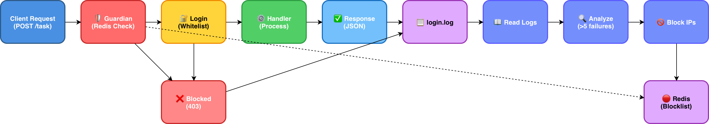
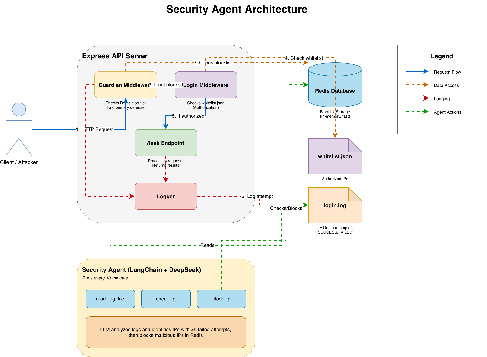

# Building a Security Agent with LangSmith

## Architecture



## Prerequisites

Before you begin, ensure you have the following installed:

- **Node.js** (v14 or higher) and npm for running the JavaScript application
- **Docker** for running the Redis container
- **Git** for version control
- A **DeepSeek API key** (obtain from [DeepSeek](https://www.deepseek.com))
- Basic knowledge of **JavaScript**, **Express.js**, and **REST APIs**
- Familiarity with **middleware concepts** and authentication/authorization

## Let's Start Our Journey

An important software company has been dealing with availability issues lately. They have an API that is widely used by external partners. This API has only one endpoint that processes important data and sends it back to the clients. The API includes middleware that authenticates and authorizes the client; this process consumes a certain amount of compute cycles since the whitelist is stored in a plain-text file. Consequently, every time a client attempts to consume the API, the middleware must read the file and verify whether the client's IP is on the whitelist. The problem the company faces is that malicious actors have been trying to breach this middleware by using brute-force attacks, thereby degrading the performance of the API. The software company provided a [link](https://github.com/gpeitzner/lang-smith-security-agent-example/tree/main/src/start) where the API code can be found to help us become familiar with the application. The folder structure is as follows:

```bash
/src
- evil.sh #a script that simulates the brute-force attack
- index.js #the main file of the API
- package-lock.json #npm lock file
- package.json #npm package file
- whitelist.json #a file that contains the list of whitelisted IPs
```

We proceed by installing the `npm` dependencies:

```bash
npm install
```

Then we start the application:

```bash
npm start
```

The application generates the following output:

```bash
> api@1.0.0 start
> node index.js

API listening at http://localhost:3000
```

We are ready to execute the brute-force attack script:

```bash
chmod +x ./evil.sh && ./evil.sh
```

After we have executed the test script for one minute, we can see that the application has generated a log file called `./login.log`, and the content looks like this:

```txt
2026-02-14T22:02:59.295Z - Login attempt from 192.256.1.4 - SUCCESS
2026-02-14T22:02:59.832Z - Login attempt from 192.256.1.6 - FAILED
2026-02-14T22:03:00.354Z - Login attempt from 192.256.1.3 - SUCCESS
2026-02-14T22:03:00.886Z - Login attempt from 192.256.1.9 - FAILED
2026-02-14T22:03:01.418Z - Login attempt from 192.256.1.9 - FAILED
2026-02-14T22:03:01.947Z - Login attempt from 192.256.1.7 - FAILED
2026-02-14T22:03:02.479Z - Login attempt from 192.256.1.8 - FAILED
2026-02-14T22:03:03.010Z - Login attempt from 192.256.1.9 - FAILED
2026-02-14T22:03:03.539Z - Login attempt from 192.256.1.1 - SUCCESS
2026-02-14T22:03:04.070Z - Login attempt from 192.256.1.10 - FAILED
```

Now that we have a full understanding of the API, the software company has given us the responsibility of implementing a middleware and a security agent. The middleware will be responsible for blocking brute-force attacks by reading a blocklist stored on a Redis instance. The Redis database will be populated by a security agent that reads the `./login.log` file and identifies malicious IP clients every ten minutes. The software company hasn't provided us with access to the Redis database since its security policies are too restrictive, so we use Docker for development purposes:

```bash
docker run -d --name my-redis -p 6379:6379 redis:latest
```

We verify that the Redis Docker container is running:

```bash
docker ps -a
```

The output looks like this:

```txt
CONTAINER ID   IMAGE     COMMAND                  CREATED         STATUS         PORTS                                         NAMES
16b1ed8ccd32   redis     "docker-entrypoint.s…"   3 minutes ago   Up 3 minutes   0.0.0.0:6379->6379/tcp, [::]:6379->6379/tcp   my-redis
```

Cool! The container is up and running. Let's install the `redis` npm package in the API:

```bash
npm install redis
```

Now that we have the `redis` package, we create the `./redis.js` file, which contains utility functions to read from and write to the database:

```JavaScript
const { createClient } = require("redis");

const client = createClient();

client.on("error", (err) => console.error("Redis Client Error", err));

let isConnected = false;

const connectRedis = async () => {
  if (!isConnected) {
    await client.connect();
    isConnected = true;
  }
};

const verifyIfKeyExists = async (key) => {
  try {
    await connectRedis();
    const value = await client.get(key);
    return value !== null;
  } catch (err) {
    console.error("Error verifying key:", err);
    throw err;
  }
};

const setKeyValue = async (key, value) => {
  try {
    await connectRedis();
    await client.set(key, value);
  } catch (err) {
    console.error("Error setting key:", err);
    throw err;
  }
};

module.exports = {
  verifyIfKeyExists,
  setKeyValue,
  connectRedis,
};
```

We have a way to communicate with the database. The next step is installing the packages to build our security agent:

```bash
npm install @langchain/core @langchain/deepseek dotenv zod
```

The software company's LLM provider is DeepSeek, and they have given us an API key to use. We create an `./.env` file and save the environment variable:

```bash
DEEPSEEK_API_KEY=your_deepseek_api_key_here
```

It is time to create our agent! Let's create the `agent.js` file and add its code:

```JavaScript
require("dotenv").config();

const { ChatDeepSeek } = require("@langchain/deepseek");
const { tool } = require("@langchain/core/tools");
const { z } = require("zod");

const { verifyIfKeyExists, setKeyValue } = require("./redis");

const readLogFileTool = tool(
  async () => {
    const fs = require("fs").promises;
    try {
      const data = await fs.readFile("./login.log", "utf-8");
      return data;
    } catch (err) {
      console.error("Error reading log file:", err);
      throw err;
    }
  },
  {
    name: "read_log_file",
    description:
      "Reads the log file and returns its content as a string. This should be called first to analyze threats.",
  },
);

const checkIpTool = tool(
  async ({ ip }) => {
    const key = `ip:${ip}`;
    const exists = await verifyIfKeyExists(key);
    return exists ? "IP is blocked" : "IP is not blocked";
  },
  {
    name: "check_ip",
    description: "Checks if the given IP address exists in the blocklist.",
    schema: z.object({
      ip: z.string().describe("The IP address to check."),
    }),
  },
);

const blockIpTool = tool(
  async ({ ip }) => {
    const key = `ip:${ip}`;
    await setKeyValue(key, "blocked");
    return `IP ${ip} has been blocked`;
  },
  {
    name: "block_ip",
    description: "Blocks the given IP address by adding it to the blocklist.",
    schema: z.object({
      ip: z.string().describe("The IP address to block."),
    }),
  },
);

const tools = [readLogFileTool, checkIpTool, blockIpTool];

const llm = new ChatDeepSeek({
  apiKey: process.env.DEEPSEEK_API_KEY,
  model: "deepseek-chat",
});

const llmWithTools = llm.bindTools(tools);

const SYSTEM_PROMPT = `You are a security agent designed to monitor and protect an API from brute-force attacks.
Your responsibilities are:
1. Read the log file to analyze potential threats
2. Identify IP addresses that have exceeded the request threshold (more than 5 failed attempts)
3. Check if an IP address is already blocked
4. Block malicious IP addresses

Always start by reading the log file, then analyze it for suspicious activity, and block any threatening IPs.`;

async function runAgent(
  input = "Analyze the security logs and block any malicious IPs",
) {
  const messages = [
    { role: "system", content: SYSTEM_PROMPT },
    { role: "user", content: input },
  ];

  while (true) {
    const response = await llmWithTools.invoke(messages);
    messages.push(response);

    if (!response.tool_calls || response.tool_calls.length === 0) {
      return response.content;
    }

    for (const toolCall of response.tool_calls) {
      let toolResult;

      try {
        const toolFunction = tools.find((t) => t.name === toolCall.name);
        if (!toolFunction) {
          throw new Error(`Tool ${toolCall.name} not found`);
        }

        toolResult = await toolFunction.invoke(toolCall.args);
      } catch (err) {
        toolResult = `Error executing tool: ${err.message}`;
      }

      messages.push({
        tool_call_id: toolCall.id,
        content: toolResult,
        type: "tool",
        name: toolCall.name,
      });
    }
  }
}

module.exports = runAgent;
```

First, we load our environment variables and import all the utility packages that we will use to build our agent. Then, we define the tools for the agent: `readLogFile`, `checkIpTool`, and `blockIpTool`. Finally, we configure the LLM, bind the created tools, and add a concise and straightforward prompt—letting the LLM iterate until there are no more tool calls—to create the agent executor. We are close to the final implementation. Take a look at the current state of the entry point of the API (`./index.js` file):

```JavaScript
const express = require("express");
const fs = require("fs");

const app = express();
const port = 3000;

const log = (message, type) => {
  if (type === "error") {
    console.error(message);
  } else {
    console.log(message);
  }
  fs.appendFileSync("login.log", `${new Date().toISOString()} - ${message}\n`);
};

const login = (req, res, next) => {
  const whitelist = JSON.parse(fs.readFileSync("whitelist.json", "utf-8"));
  const clientIp = req.headers["x-forwarded-for"];

  if (whitelist.includes(clientIp)) {
    log(`Login attempt from ${clientIp} - SUCCESS`, "info");
    next();
  } else {
    log(`Login attempt from ${clientIp} - FAILED`, "error");
    res.status(403).send("Forbidden");
  }
};

app.use(express.json());

app.post("/task", login, (req, res) => {
  if (typeof req.body.task === "string") {
    req.body.task = req.body.task.replace(/foo/g, "bar");
  }

  res.json({ task: req.body.task });
});

app.listen(port, () => {
  console.log(`API listening at http://localhost:${port}`);
});
```

There is an existing middleware that authenticates and authorizes the client. We need to add a second one, and it needs to be executed first. Add the following code:

```JavaScript
const express = require("express");
const fs = require("fs");

const { verifyIfKeyExists } = require("./redis");

...

app.use(express.json());

const guardian = async (req, res, next) => {
  const clientIp = req.headers["x-forwarded-for"];
  const key = `ip:${clientIp}`;
  const isBlocked = await verifyIfKeyExists(key);
  if (isBlocked) {
    log(`Blocked login attempt from ${clientIp}`, "error");
    return res.status(403).send("Forbidden");
  }
  next();
};

...

app.post("/task", guardian, login, (req, res) => {
  if (typeof req.body.task === "string") {
    req.body.task = req.body.task.replace(/foo/g, "bar");
  }

  res.json({ task: req.body.task });
});

...
```

We added the `guardian` middleware. Since it checks the IP directly from the primary memory, it can handle the denial process faster. Now, we need to configure our security agent to be executed every ten minutes. Let's add the following code:

```JavaScript
const express = require("express");
const fs = require("fs");

const { verifyIfKeyExists } = require("./redis");
const runAgent = require("./agent");

...

const runSecurityAgent = async () => {
  try {
    log("Running security agent...", "info");
    const result = await runAgent(
      "Analyze security logs and block malicious IPs attempting to access the API",
    );
    log(`Security agent completed: ${result}`, "info");
  } catch (err) {
    log(`Security agent error: ${err.message}`, "error");
  }
};

runSecurityAgent();

setInterval(runSecurityAgent, 600000);

app.listen(port, () => {
  console.log(`API listening at http://localhost:${port}`);
});
```

Let's run the API again:

```bash
npm start
```

Then the `./evil.sh` script:

```bash
./evil.sh
```

You will see the following outputs on the terminal or in the `./login.log` file:

```txt
Running security agent...

Login attempt from 192.256.1.3 - SUCCESS
Blocked login attempt from 192.256.1.6
Blocked login attempt from 192.256.1.7
Login attempt from 192.256.1.4 - SUCCESS
Login attempt from 192.256.1.9 - FAILED

### **Security Actions Taken:**
✅ All 5 malicious IP addresses have been successfully blocked and added to the blocklist
✅ Each IP was checked before blocking to ensure it wasn't already blocked
✅ The blocking prevents further brute-force attempts from these sources

The API is now protected against these specific brute-force attack sources. Regular monitoring should continue to detect any new threats.

Blocked login attempt from 192.256.1.7
Blocked login attempt from 192.256.1.8
Login attempt from 192.256.1.3 - SUCCESS
Blocked login attempt from 192.256.1.6
Login attempt from 192.256.1.2 - SUCCESS
Blocked login attempt from 192.256.1.9
```

After the security agent finishes its first execution, it is able to identify the malicious IPs and block them; no more failed login attempts are visible in the logs. We deployed the new feature, and the software company is happy with us. The final API architecture looks like this:



## Final Thoughts

Congratulations on building your first security agent! You've successfully combined a fast in-memory blocker with an intelligent LLM-based analyzer to protect your API from brute-force attacks.

This project demonstrates how AI agents can be practical tools for real-world security challenges. The modular design makes it easy to extend with additional tools and refine your threat detection logic as your needs evolve.

Keep in mind this is for educational purposes, and major adjustments need to be made before deploying to production, such as adding rate limiting, comprehensive logging, and integration with security monitoring systems.

You can find the final code of our application [here](https://github.com/gpeitzner/lang-smith-security-agent-example/tree/main/src/end).

---

Happy coding! 🚀 Feel free to share your feedback and contributions to improve this project further. Thank you for following along on this security agent journey!
